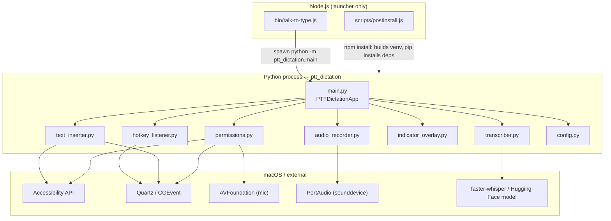
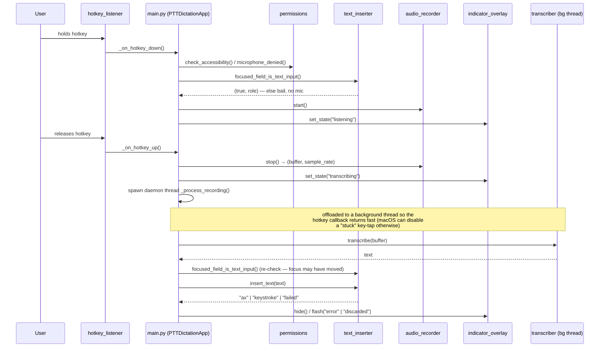

# talk-to-type

Push-to-talk dictation for macOS. Hold a key, speak, let go — the words are
typed straight into whatever app has focus. Transcription runs fully
offline on your Mac (via [faster-whisper](https://github.com/SYSTRAN/faster-whisper)/Whisper),
so nothing you say is sent anywhere.

- **Local and private** — no cloud API, no network calls for transcription, no audio ever written to disk
- **Works almost anywhere** — native apps (TextEdit, Mail), browsers (Chrome, Safari), Electron apps (VS Code, Slack), and terminals (Terminal.app, iTerm2)
- **Push-to-talk, not always-on** — the mic only activates while you're holding the key over a real text field
- **Menu bar app** — lightweight `rumps`-based tray icon, no Dock clutter

## Requirements

- macOS (this relies on macOS-specific APIs — it will not run on Linux or Windows)
- [Node.js](https://nodejs.org/) 16+ and npm, to install and run this package
- Python 3.11+ — if you don't already have it, install with:
  ```
  brew install python@3.11
  ```
  (npm install will fail with a clear message if this is missing)

## Install

```
npm install -g talk-to-type
```

This is a Node/npm wrapper around a Python app — npm can't install Python
packages directly, so `npm install` also builds a private Python virtual
environment inside the package and installs `faster-whisper`, `sounddevice`,
`pynput`, and the other Python dependencies into it automatically. The first
install can take a minute or two.

## First-time setup

### 1. Grant three macOS permissions

Go to **System Settings → Privacy & Security** and grant these to whatever
app actually runs the `talk-to-type` command (your Terminal, iTerm2, or VS
Code — not to "the script" itself):

| Permission | Why it's needed |
|---|---|
| **Microphone** | To record your voice. macOS prompts for this automatically the first time it tries to record. |
| **Accessibility** | To read which text field is focused, and to insert text into other apps. |
| **Input Monitoring** | To detect the push-to-talk key being held, system-wide. |

After granting Accessibility and Input Monitoring, **fully quit and reopen**
that terminal app — permission grants don't take effect until the app
restarts.

Run `talk-to-type` any time to get a live status check — the menu bar
icon's **Check Permissions** item tells you exactly what's still missing and
can jump you straight to the right settings page.

### 2. First launch downloads the speech model

The first time it runs, it downloads the `small.en` Whisper model
(a few hundred MB) from Hugging Face. This needs an internet connection and
can take a minute depending on your connection. After that, it's cached
locally and loads in about 2-3 seconds on every future launch.

## Usage

```
talk-to-type
```

This starts the menu bar app. By default, hold **Right Option** to talk,
release to have the transcribed text typed in. You can change the hotkey
(Fn, Right Option, or Right Command) from the menu bar icon's **Choose
Hotkey** submenu.

Nothing happens if you hold the key with no text field focused (Desktop,
Finder, a button) — that's intentional, not a bug: the mic never even
turns on in that case.

## Configuration

Settings are stored at:

```
~/Library/Application Support/PTTDictation/config.json
```

| Key | Default | Meaning |
|---|---|---|
| `hotkey` | `"right_option"` | `fn`, `right_option`, or `right_command` |
| `model_size` | `"small.en"` | Any [faster-whisper model size](https://github.com/SYSTRAN/faster-whisper#model-conversion) |
| `min_hold_ms` | `150` | Taps shorter than this are ignored (avoids accidental presses) |
| `max_record_seconds` | `90` | A held key auto-stops recording after this long |

## How it works

```
[key down]  -> check the focused app/text field
               -> not a text field? do nothing at all (no mic, no indicator)
               -> is a text field? start recording, show a "Listening" indicator
[key up]    -> stop recording, show "Transcribing"
               -> run the audio through Whisper, locally, entirely in memory
               -> re-check focus (it may have changed while you were talking)
               -> type the result into whatever's now focused
```

Text insertion uses two different strategies depending on the app, chosen
automatically:

- **Native macOS apps** (TextEdit, Mail, Notes) use the Accessibility API's
  "set selected text" method — a single, cleanly undo-able insertion.
- **Browsers and Electron apps** (Chrome, Safari, VS Code, Slack) use
  simulated keystrokes instead. Their rich-text editors (React/ProseMirror
  and similar) often report success for the "clean" method without actually
  applying the change, so real keystrokes — which go through the same input
  pipeline the page/app already listens to — are more reliable there.
- **Terminal apps** (Terminal.app, iTerm2, Warp, etc.) don't expose a
  focusable text element through the Accessibility API at all, since they
  draw their own text. These are recognized by app identity and always
  treated as valid targets, typed via simulated keystrokes.

## Architecture

Node is a launcher only — `bin/talk-to-type.js` spawns a private venv's Python
and passes stdio through. `scripts/postinstall.js` builds that venv on
`npm install`. Everything else — hotkey detection, recording, transcription,
text insertion, the menu bar UI — is the Python package `ptt_dictation`,
orchestrated by `PTTDictationApp` (`main.py`, a `rumps.App` subclass running
the AppKit runloop on the main thread).



Sequence for one hold-to-release cycle:



### Module reference

| Module | Responsibility | Key entry points |
| --- | --- | --- |
| `main.py` | Orchestrates everything; `rumps.App` runloop on the main thread | `PTTDictationApp` |
| `hotkey_listener.py` | Global key down/up detection | `create_listener()` → `PynputHotkeyListener` (right_option/right_command) or `FnHotkeyListener` (raw Quartz event tap) |
| `audio_recorder.py` | Mic capture into an in-memory buffer | `AudioRecorder.start()` / `.stop()`, `rms()` |
| `transcriber.py` | Runs Whisper on the recorded buffer | `Transcriber.load()`, `.is_ready`, `.transcribe(buffer)` |
| `text_inserter.py` | Finds the focused text field and types the result in | `focused_field_is_text_input()`, `frontmost_bundle_id()`, `insert_text()` |
| `indicator_overlay.py` | Floating "Listening / Transcribing" indicator | `IndicatorOverlay.set_state()`, `.hide()` |
| `permissions.py` | Checks/prompts for Accessibility, Mic, Input Monitoring | `check_accessibility()`, `microphone_denied()`, `missing_permissions()` |
| `config.py` | Reads/writes `~/Library/Application Support/PTTDictation/config.json` | `load_config()`, `save_config()` |

Threading model: hotkey listening runs on its own thread (pynput's internal
thread, or a polling daemon thread for `fn`); the Whisper model loads on a
background thread at startup; and each hold-to-release cycle's transcription
and text insertion runs on a fresh daemon thread so the hotkey callback
itself stays fast. `IndicatorOverlay.set_state()` marshals back to the main thread
(`AppHelper.callAfter`) since AppKit UI must run there.

## Privacy

- Audio is recorded straight into memory, transcribed, and the buffer is
  discarded immediately after — it is never written to disk.
- Transcription runs entirely on-device via `faster-whisper`. No audio or
  text is ever sent to a server.
- The mic only activates between a key-down and key-up over a focused text
  field. It is never left running in the background.

## Troubleshooting

- **Nothing happens when I hold the key** — check that a real text field is
  focused (this is required by design), and that Accessibility + Input
  Monitoring are both granted to the app you're running this from.
- **The hotkey works but no text appears** — usually a missing Microphone
  or Accessibility grant, or the app was granted permission but not
  restarted afterward.
- **First hold in a new app is slightly slow** — some apps (Chrome, VS
  Code, Slack) don't expose their full accessibility info until asked; this
  is a one-time ~150ms delay per app, not a bug.
- **Model takes a long time to load / transcribe** — if your Mac is under
  heavy load from other apps, Whisper will be slow too. Check Activity
  Monitor if this seems unusually severe.

## Todo

- **Make the background process self-healing.** It currently only starts at
  login (`RunAtLoad: true`) and does not restart itself if it ever quits
  unexpectedly (a crash, or accidentally clicking "Quit" in the menu bar) —
  `KeepAlive` is set to `false` in `scripts/launch_agent.sh`'s generated
  LaunchAgent. This has caused confusing "the hotkey just stopped working"
  moments where the fix was simply restarting it
  (`npm run enable-autostart`). Flipping `KeepAlive` to `true` would fix
  this, at the tradeoff of possibly crash-looping if something is
  genuinely broken instead of failing visibly once.
- **Confirm collaborator access works end-to-end** for anyone invited to
  the private repo — clone, `npm install`, first run, permission setup,
  all the way through a working dictation.
- **Fix dictation in iMessage.** Reported broken by a collaborator testing
  on their own Mac ("working" everywhere else they tried, "not for my
  iMessage app"). Not yet reproduced or root-caused on the original dev
  machine — iMessage's compose box tested fine there (recognized as
  `AXTextField`, inserted successfully) — so this looks like it may be
  machine/version-specific rather than a universal bug. Next step: get the
  exact symptom from the reporter (nothing happens at all vs. wrong
  text vs. partial text) and, ideally, have them run the AX-role
  diagnostic against their own Messages compose box to see what it
  actually reports there.

## Roadmap

- **Windows support** — currently macOS-only. The app is built entirely on
  Apple-specific frameworks (Accessibility API for text insertion, AppKit
  for the floating indicator, `rumps` for the menu bar icon), so this would
  mean rewriting the permissions, text-insertion, and tray-icon layers with
  Windows equivalents rather than a small patch.
- **Mobile support** — running this on a phone/tablet. A different problem
  from Windows support: mobile OSes don't expose the same kind of
  system-wide "insert text into whatever app is focused" capability, so
  this would likely need a different interaction model (e.g. a keyboard
  extension or share-sheet action) rather than a direct port.

## License

MIT
